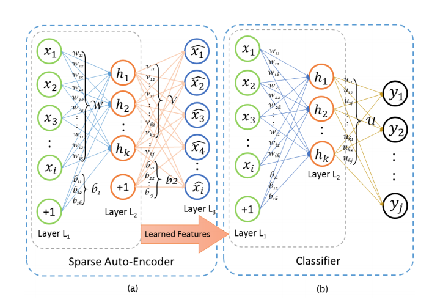
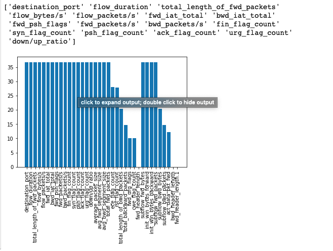
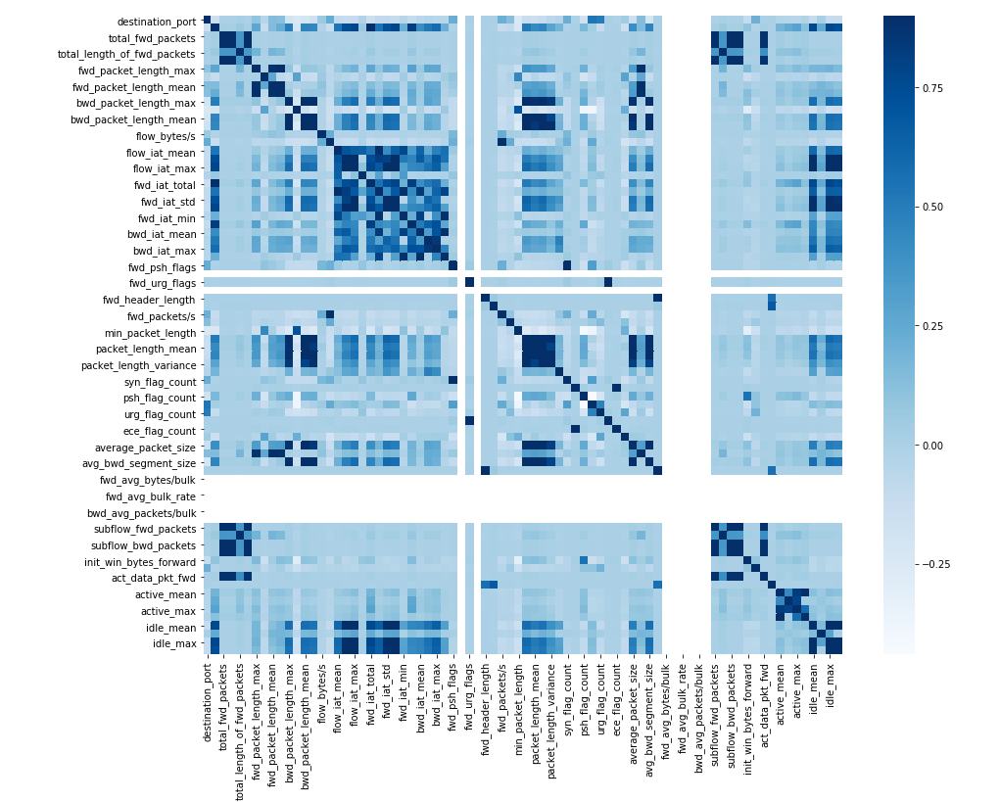
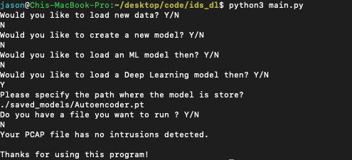

> Implementing an Intrusion Detection System with Pytorch

## Introduction
Intrusion detection systems deployed in the industry are generally flooded with False Positives (Flagged packets that are actually benign). Although false positives are preferred over false negatives, the ideal IDS would be able to only pick out packets that are actually malicious.

Traditional methods of intrusion detection systems range from signature based (rules flagging known behavior) to anomaly based (naive bayes classifiers, looking at statistical anomaly) etc. Naive bayes have been traditionally successful in detecting spam due to its ability to ignore the distributions of the dataset. However, we would like to ask whether there are more sophisticated methods that can further drive down the false positive rates of an IDS.

The difficulty of developing a truly accurate IDS system is that intrusions only occur around 0.0001% of the time in real-world situations. Hence, ML practicioners face the problem of having a hugely imbalanced dataset.

## Project Overview
For this project, I implemented a research paper about building Intrusion Detection Systems with Deep Learning. The main model used is a sparse autoencoder connected with a softmax classifier. The link to the actual paper is here: [Research Paper](https://eudl.eu/pdf/10.4108/eai.3-12-2015.2262516)

> Dataset used: [ISCX](https://www.unb.ca/cic/datasets/ids-2017.html)

## Methodology
Since the ISCX dataset mimics a real life scenario, there are less than 20% of data regarding intrusions. The explanation of the relatively high amount of packets in intrusion data (compared to industry data) is that most of the malicious packets stem from DDos attacks and port scans.

Due to the data's highly imbalanced nature, I've decided to train each model by downsampling the data first. Whilst the downsampling decreases the accuracy slightly, it significantly increases precision and recall.

After downsampling, I did a train-test split of 70/30 and trained on the respective models: Logistic Regression, Random Forest, ID3 Decision Tree, and a Sparse Autoencoder + Softmax Classifier.

Here's a diagram outlining the sparse autoencoder used:

## Interesting findings

1. Among all the 80~ features generated by the CICFlowMeter, only few are of importance. Among which, the port that a packet goes, its flow duration, packet length and most uncorrelated features are of highest importance. Syn Ack flag counts are also of importance, perhaps due to the high amount of benign packets.

2. Most features about forward packets are not correlated with any of the other features

## End product

> A command line application that takes CICFlowMeter processed PCAP files and detect number of intrusions.

